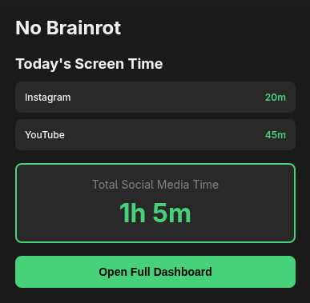
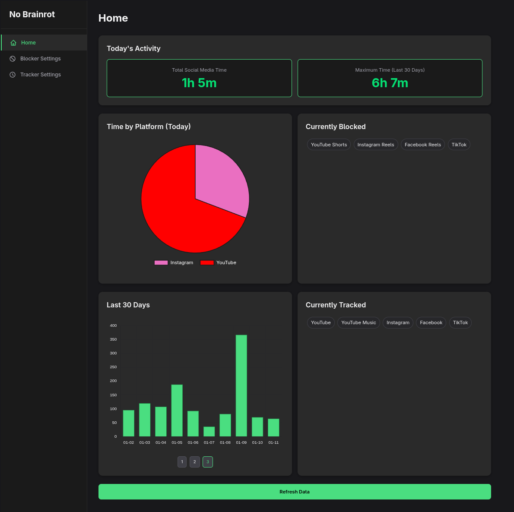

# No Brainrot
No Brainrot is a browser extension that will block all shortform content from youtube, instagram, tiktok and shorts while making sure that other features like messaging, long form video and posting remains!

## Chrome Web Store Link
https://chromewebstore.google.com/detail/no-brainrot-%E2%80%94-block-short/lkicfbepffbgaalgkdkjlojkfniaffnm

## Currently Blocked Websites
- Youtube shorts (check ./src/blockers/YoutubeBlocker.ts to see)
- Instagram Reels (check ./src/blockers/InstagramBlocker.ts to see)
- Facebook Reels (check ./src/blockers/FacebookBlocker.ts to see)
- Tiktok (check ./src/blockers/TiktokBlocker.ts to see)

## Social Media Time tracking
The browser extension will log the time you spend on certain social media webistes(YT, IG, LinkedIn stuff), It will not track what you are doing just that you are using them!

## Run and Build
```
#watch the errors with terminal
npm run watch

#Just build the dist
npm run build
```

## Testing with Playwright
```
npx playwright test --project=brave-no-brainrot
```


## Current Features
- Short Form Content Blocker (Can choose to enable/disable in the dashboard)
- Time Tracking for Social Media/Listed Websites (Can add websites of your own choosing)
- Dashboard which basically displays the overall analystics of your tracked time and history and settings.
- Bargraph that displays the time you spent in the last 30 days
- Maximum time you spent in the last 30 days displayed in the dashboard

## Preview of the Extension Popup


## Preview of Dashboard


## Contributing
1. Fork the repo and create a feature branch.
2. Run `npm install`.
3. Develop with `npm run watch` (or `npm run build` for a one-off build).
4. Add tests if applicable, and ensure the build passes.
5. Submit a PR describing the change.

## License
This project is licensed under the MIT License - see the [LICENSE](LICENSE) file for details.

